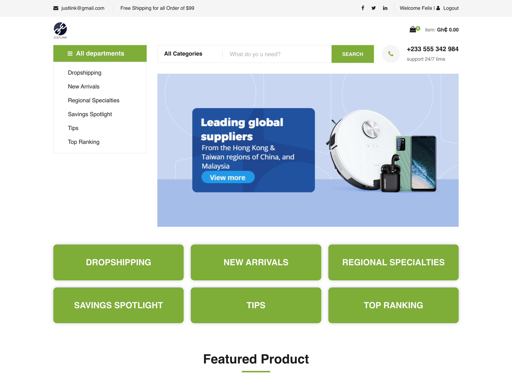
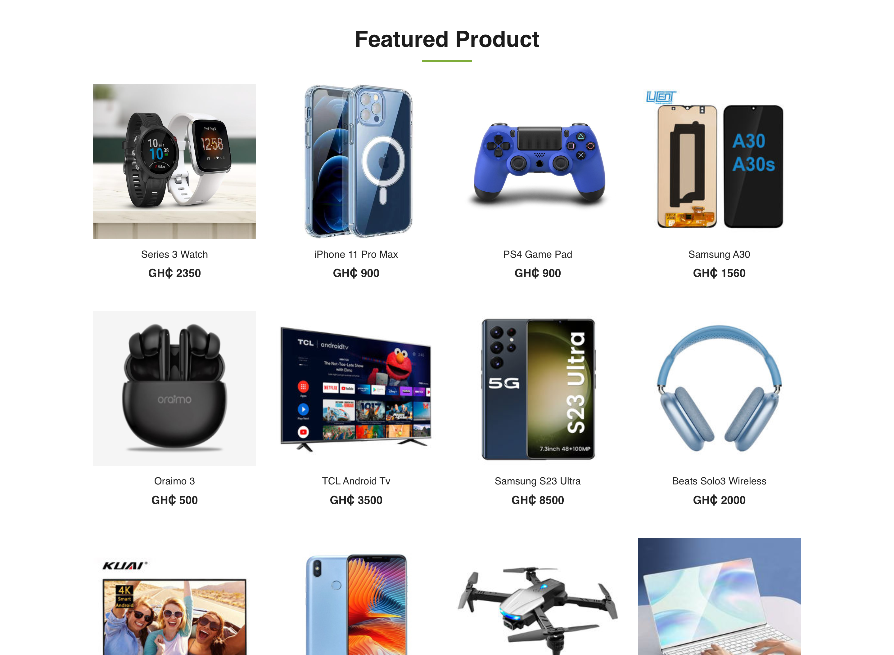
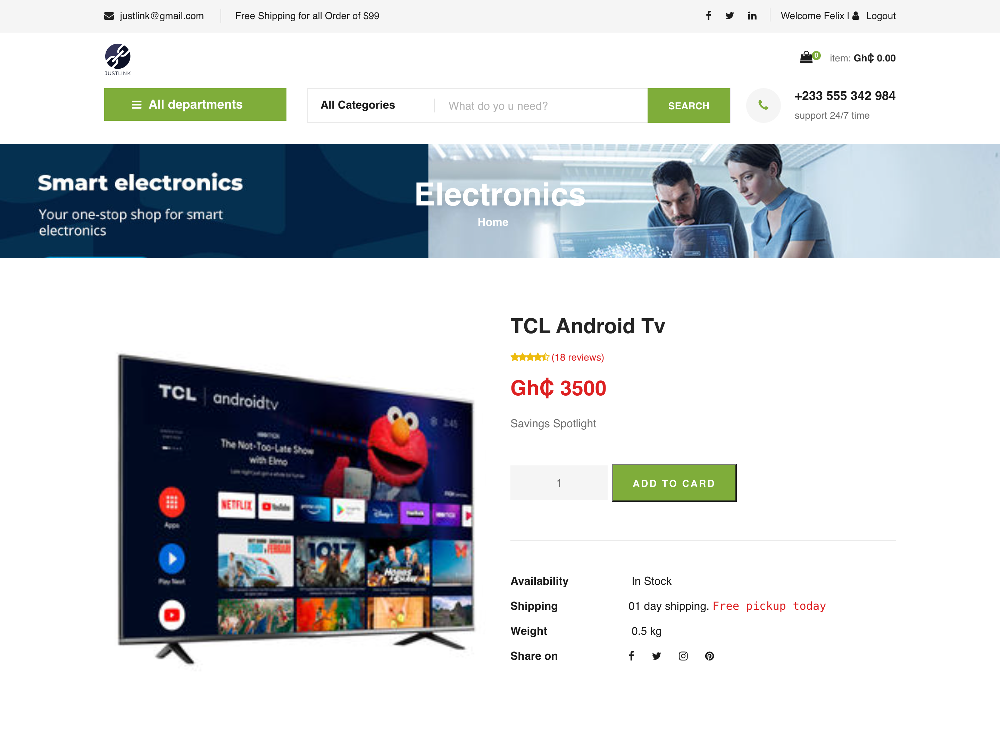
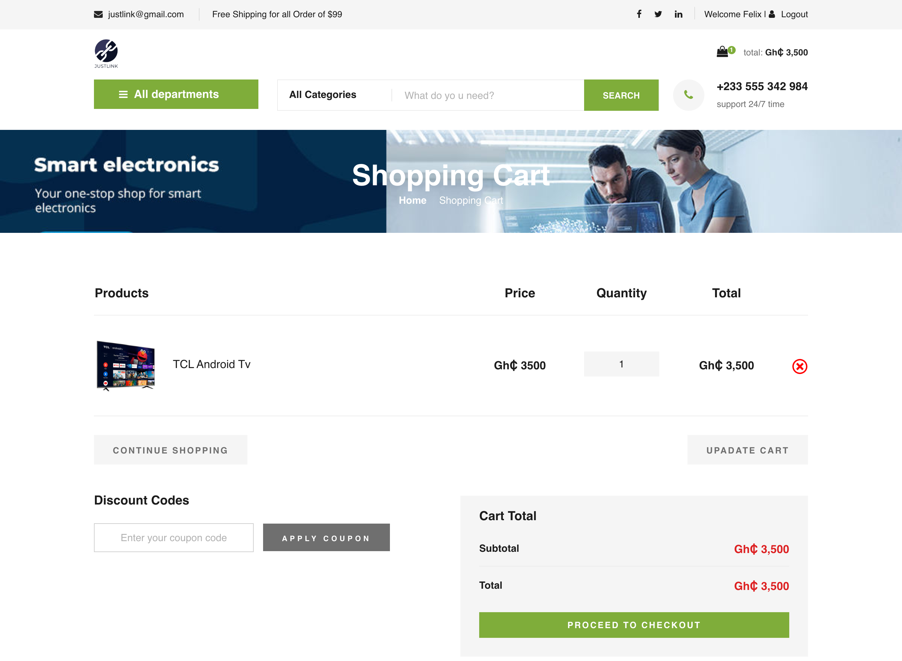
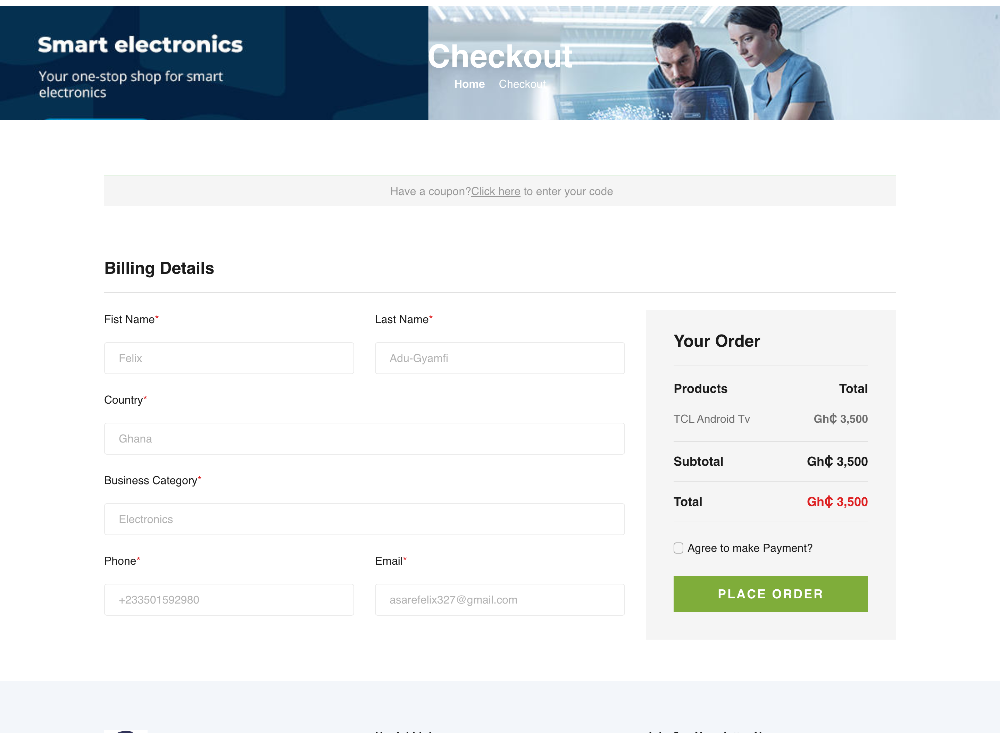

# Introduction to Portfolio Project for ALX

## 📸 Screenshots

| Home Page                                            | Products Page                                           | Details Page                                           |
| ---------------------------------------------------- | ------------------------------------------------------- | ------------------------------------------------------ |
|  |  |  |

| Cart Page                                       | Checkout Page                                           |
| ----------------------------------------------- | ------------------------------------------------------- |
|  |  |

## Justlnk Online Shop

This is a portfolio for ALX to showcase the skills and experience earned in the ALX Software Engineering program for the fundamental period.

## A link to the deployed site

- https://portfolio-v2-three-murex.vercel.app/

# Technologies

- React
- Typescript
- React Toastify
- Prime React UI
- React Router Dom

## Setup / Installation

To run this project, locally using npm:

- Clone this repository

```bash
$ git clone https://github.com/flexywork327/portfolio-v2
```

- Install the required dependencies

```bash
$ npm install
```

- Start the development environment

```bash
$ npm start
```

- The application should now be running at http://localhost:5000

### `npm run build`

Builds the app for production to the `build` folder.\
It correctly bundles React in production mode and optimizes the build for the best performance.

The build is minified and the filenames include the hashes.\
Your app is ready to be deployed!

See the section about [deployment](https://facebook.github.io/create-react-app/docs/deployment) for more information.

## Contributors

| Felix Asare (https://github.com/flexywork327/)                                            | Foster Adu-Gyamfi (https://github.com/Foxynero)                                       | Esther Adebimpe (https://github.com/legacycodine)                                         |
| ----------------------------------------------------------------------------------------- | ------------------------------------------------------------------------------------- | ----------------------------------------------------------------------------------------- |
|  |  |  |
